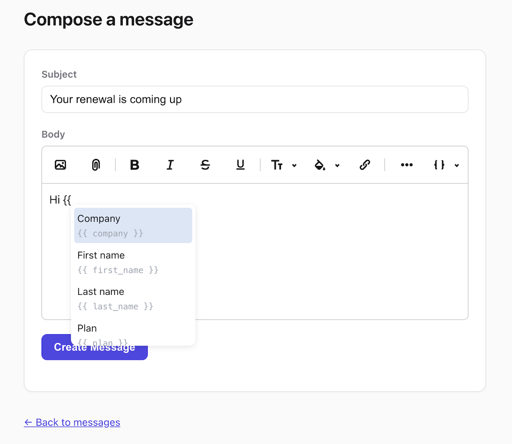
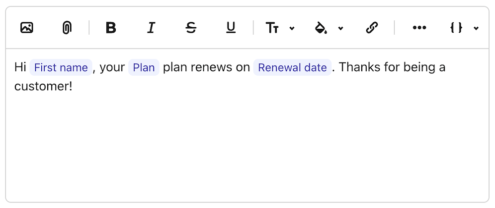
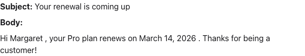
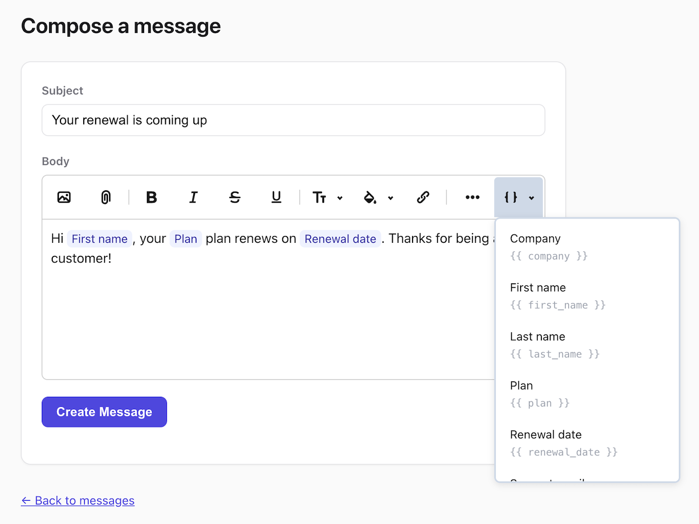

# lexxy-variables

Insert and safely resolve variables in [Lexxy](https://github.com/basecamp/lexxy)
rich text. The gem gives you an editor button (and a `{{` prompt) for inserting
variables into your text. Each variable is stored as an [Action Text
attachment](https://guides.rubyonrails.org/action_text_overview.html#rendering-attachments),
an `<action-text-attachment>` chip with its own content type, not as literal
`{{ var_name }}` markup. At render time the gem resolves each chip to its `value`.
You decide what variables exist and what they turn into.

Because variables are just Action Text attachments, you can register new
chip types with `register_attachment` (see [Full configuration](#full-configuration)):
a chip that renders as `:text` resolves to an escaped string, one that renders
as `:html` splices rich content in before sanitization.

Liquid is **optional**. The default renderer is plain, injection-safe string
substitution and pulls in no template engine.

<p align="center">
  
</p>

## Requirements

Ruby 3.2+, Rails 8.0+, and Lexxy 0.9.24+ (earlier versions have a regression
that breaks inserting from a two-character `{{` trigger). Works with
importmap-rails or any JavaScript bundler (esbuild, vite, webpack).

## Install

Ruby:

```ruby
# Gemfile
gem "lexxy-variables"
```

Then wire up the JavaScript, either via importmap or a bundler.

**importmap-rails.** Install Lexxy per [its docs](https://basecamp.github.io/lexxy/docs/)
(`pin "lexxy", to: "lexxy.js"`). The engine pins `lexxy-variables` and
`@37signals/lexxy` for you, so the only step left is registering the extension
in your entrypoint:

```js
// app/javascript/application.js
import * as Lexxy from "lexxy"
import VariableExtension from "lexxy-variables"

Lexxy.configure({ global: { extensions: [ VariableExtension ] } })
```

**Bundler (esbuild, vite, webpack).** The extension is also distributed as an
npm package. Install it alongside Lexxy:

```sh
yarn add @37signals/lexxy lexxy-variables
```

and register the extension in your JavaScript.

```js
// app/javascript/application.js
import * as Lexxy from "@37signals/lexxy"
import VariableExtension from "lexxy-variables"

Lexxy.configure({ global: { extensions: [ VariableExtension ] } })
```

## Minimal configuration

`catalog` is the list users pick from in the editor. `assigns` is the lookup that
turns a key into a value at render time. `catalog` is required and `assigns` is
optional. Leave it out and the gem reads `value` straight off the catalog item.

Put the `configure` block in an initializer, e.g. `config/initializers/lexxy_variables.rb`:

```ruby
LexxyVariables.configure do |c|
  c.catalog = [ { key: "company", name: "Company", value: "Acme" } ]
end
```

The gem adds two view helpers, one for each side of the workflow: one to author
content and one to display it.

On the **editor page** (the form where content is composed), render the prompt
*inside* the Lexxy editor. The editor extension looks for the `<lexxy-prompt>`
within the `<lexxy-editor>` element, so it must be nested in the `rich_text_area`
block. That is what feeds the `{{` popup and the toolbar dropdown:

```erb
<%= form_with model: @record do |form| %>
  <%= form.rich_text_area :body do %>
    <%= lexxy_variables_prompt %>
  <% end %>
  <%= form.submit %>
<% end %>
```

Typing `{{` opens the prompt shown above, and there's also a toolbar dropdown
for picking from the same list. Inserted variables appear as chips in the editor:

<p align="center">
  
</p>

On the **display page** (where the saved content is shown to readers), resolve
the stored rich text. This is what swaps each variable chip for its value:

```erb
<%= render_lexxy_content(@record.body) %>
```

Each chip resolves to its value, so the reader sees finished text:

<p align="center">
  
</p>

`@record` and `:body` are placeholders. Use whatever model and Action Text
attribute hold your content.

## Full configuration

`context` is yours to define. The gem passes it untouched to your catalog,
assigns, and resolve callables, so put whatever they need in it. That might be a
tenant, `nil`, or any object.

```ruby
LexxyVariables.configure do |c|
  # What users can insert: the {{ prompt and the toolbar dropdown read this.
  c.catalog = ->(context) { context.variables + BuiltinVariable.all }

  # What each used key resolves to at render time.
  c.assigns = ->(context, used_keys) { MyResolver.assigns(context, used_keys) }

  # Opt into Liquid for dotted access, drops, and filters.
  c.renderer = LexxyVariables::Renderers::Liquid.new

  # A second chip type: snippets expand to rich HTML instead of an escaped value.
  c.register_attachment(
    content_type: "application/vnd.actiontext.snippet",
    renders_as: :html,
    label: "Snippet", # shown as a badge in the prompt when the list mixes types
    resolve: ->(node, context) { MySnippets.content_for(node, context) }
  )
end
```

### All options

| Option | Default | What it does |
| --- | --- | --- |
| `catalog` | `[]` | The insertable items shown in the `{{` prompt and the toolbar dropdown. A list, a zero-arg lambda, or a `->(context)` lambda. Items respond to `#key` and `#name`, and optionally `#value` and `#attachable_sgid`. |
| `assigns` | reads `#value` off catalog items | The render-time lookup. A `->(context, used_keys)` or `->(used_keys)` lambda that receives only the keys used in the content being rendered and returns a `{ key => value }` hash. |
| `renderer` | `Renderers::Substitution.new` | How placeholders become values. The default is plain, escaped string substitution with no template engine. Swap in `Renderers::Liquid.new` for dotted access, drops, and filters. |
| `sort` | `:name` | How the catalog is ordered in the prompt and dropdown. `:name` (case-insensitive alphabetical), `:key`, `false` to keep the catalog's given order, or a lambda (a `->(item)` sort key or a `->(a, b)` comparator). |
| `max_fragment_depth` | `1` | How many levels of `renders_as: :html` chips expand. The default resolves the variables inside a snippet but drops a snippet nested inside another snippet. Raise it to allow deeper nesting. |
| `content_layout` | `"layouts/action_text/contents/content"` | The Action Text layout that wraps rendered output. Point it at your own partial to change the wrapper, for example when rendering into emails. |
| `register_attachment(content_type:, resolve:, renders_as:, label:)` | variable type pre-registered | Adds or replaces a chip type. `renders_as:` is `:text` (default, the resolver returns a key whose escaped value is substituted in) or `:html` (splices rich HTML in pre-sanitize, resolving inner `:text` chips in the same pass, bounded by `max_fragment_depth`). `label:` is the badge shown in the prompt when the list mixes types. Re-registering a content type (including the built-in variable type) replaces it, which is how you'd swap in a custom variable resolver. |

### Helper options

Both view helpers take `context:` (see [Multi-tenancy](#multi-tenancy)). Beyond
that, `lexxy_variables_prompt` lets you change the trigger characters and the
empty state, and `render_lexxy_content` can render under a specific locale by
wrapping the whole pass in `I18n.with_locale`.

```erb
<%= lexxy_variables_prompt(trigger: "%%", empty_results: t(".no_variables")) %>

<%= render_lexxy_content(@record.body, locale: recipient.locale) %>
```

## Multi-tenancy

Tenancy is optional. If your app is multi-tenant, pass the tenant through as
`context`. With [acts_as_tenant](https://github.com/ErwinM/acts_as_tenant) that
looks like:

```ruby
LexxyVariables.configure do |c|
  c.catalog = ->(tenant) { tenant.variables }
end
```

Both view helpers take the same `context:`. Pass the tenant on the editor page:

```erb
<%= form.rich_text_area :body do %>
  <%= lexxy_variables_prompt(context: ActsAsTenant.current_tenant) %>
<% end %>
```

and again on the display page:

```erb
<%= render_lexxy_content(@record.body, context: ActsAsTenant.current_tenant) %>
```

Or skip `context` entirely and rely on acts_as_tenant scoping queries to the
current tenant for you:

```ruby
LexxyVariables.configure do |c|
  c.catalog = -> { Variable.all }  # already scoped to ActsAsTenant.current_tenant
  c.assigns = ->(keys) { Variable.where(key: keys).pluck(:key, :value).to_h }
end
```

## Styling

The gem ships a default stylesheet so the editor UI works out of the box. Import
it and override the CSS custom properties (or the classes) to match your app.

```css
/* bundlers (esbuild, vite): */
@import "lexxy-variables/styles";
```

```erb
<%# importmap / asset-pipeline hosts: the engine puts the vendored CSS on the
    asset path, so link it (or @import "lexxy_variables.css" from your CSS) %>
<%= stylesheet_link_tag "lexxy_variables" %>
```

Classes the gem emits: `.lexxy-variable` (token chip), `.lexxy-variable--block`
(chips that expand to a block, e.g. snippets), `.lexxy-variables-menu` /
`.lexxy-variables-menu__item` (the toolbar dropdown), and `.lexxy-variables-option`
/ `__header` / `__name` / `__type` / `__code` (option content, shared by the
`{{` prompt popup and the dropdown).

<p align="center">
  
</p>

Override without touching the classes:

```css
:root {
  --lexxy-variable-background: #fef3c7;
  --lexxy-variable-color: #92400e;
  --lexxy-variable-block-border: 1px dashed #f59e0b;
  --lexxy-variables-menu-item-hover-background: #f4f4f5;
  --lexxy-variables-option-code-color: #a1a1aa;
  --lexxy-variables-option-type-background: #f4f4f5;
  --lexxy-variables-option-type-color: #71717a;
  --lexxy-variables-prompt-max-width: 24rem; /* widen the {{ prompt popup (Lexxy caps at 20ch) */
}
```

Your prompt items should use the option classes so they appear the same in the
popup and the dropdown:

```erb
<template type="menu">
  <span class="lexxy-variables-option">
    <span class="lexxy-variables-option__name"><%= variable.name %></span>
    <code class="lexxy-variables-option__code">{{ <%= variable.key %> }}</code>
  </span>
</template>
```

## Security model

- Every render gets a fresh random nonce that guards the placeholder tokens, so an
  author can't fake a substitution by typing the token pattern into the body.
- Chips are swapped for those nonce tokens before the HTML is sanitized, and the
  real values go in afterward. A `:text` chip resolves to HTML-escaped text that
  can't do anything, while an `:html` chip is spliced in before sanitizing so the
  sanitizer still scrubs it.
- Only the Liquid renderer deals with template-engine braces (`{{ }}` and ``).
  The default renderer runs no engine at all, so there's nothing there to inject into.

## Contributing

Bug reports and pull requests are welcome. To get set up:

```sh
bundle install
bundle exec rake test     # run the test suite
bundle exec rubocop       # lint
```

The browser suite drives the real editor in Chromium through the same import
map an importmap host uses, covering the `{{` prompt and the toolbar dropdown:

```sh
npm install
npx playwright install chromium
npm run test:browser
```

The editor extension in `src/` is compiled into `vendor/` (the copy importmap
apps load). If you change anything under `src/`, rebuild before committing or CI
will fail:

```sh
npm install
npm run build
```

CI runs the tests across Ruby 3.2–4.0, rubocop, the browser suite, and a check
that `vendor/` matches `src/`.

